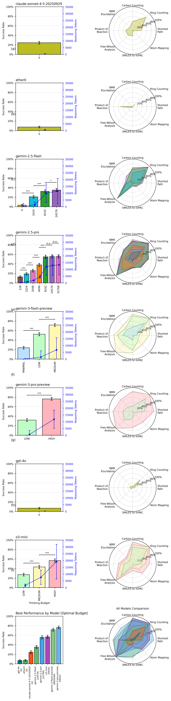
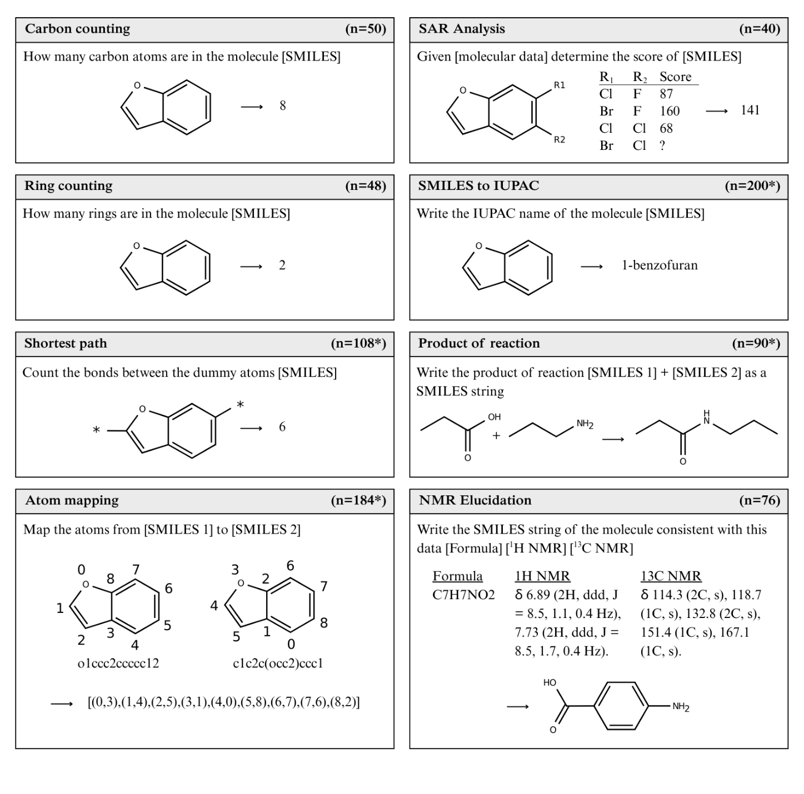

# ChemIQ - Assessing the Chemical Intelligence of Large Language Models
ChemIQ is a benchmark designed to test the ability of LLMs to interpret molecular structures and perform chemical reasoning. Questions in this benchmark range from counting the number of carbon atoms in a molecule, to performing NMR elucidation. 

Read the paper here: https://arxiv.org/abs/2505.07735

<p align="center"></p>

## Quick start
Create a conda environment:
```bash
conda create -n ChemIQ python=3.11 numpy pandas matplotlib scipy requests openai anthropic google-generativeai rdkit jupyterlab ipykernel -c conda-forge
```
And activate it:
```bash
conda activate ChemIQ
```

## Setup
Create a `.env` file with your API keys:
```bash
OPENAI_API_KEY=sk-...
ANTHROPIC_API_KEY=sk-ant-...
GOOGLE_API_KEY=AIza...
```

Or set them as environment variables:
```bash
export OPENAI_API_KEY="sk-..."
export ANTHROPIC_API_KEY="sk-ant-..."
export GOOGLE_API_KEY="AIza..."
```

## Running the Benchmark

The workflow consists of two steps: submitting batches of questions to LLMs and evaluating the results using the automated pipeline.

### 1. Submit Questions
Use `submit_batch.py` to send questions to supported providers (OpenAI, Anthropic, Google). This script handles "thinking budget" parameters and file management.

**Example: Run all questions on Gemini 3 Flash with high reasoning**
```bash
python3 submit_batch.py \
    --provider google \
    --model gemini-3-flash-preview \
    --thinking-budget high \
    --questions questions/chemiq.jsonl \
    --env-file .env
```

**Parameters:**
*   `--provider`: `openai`, `anthropic`, or `google`.
*   `--model`: Model ID (e.g., `gpt-4o`, `claude-3-5-sonnet-20241022`).
*   `--thinking-budget`: Controls reasoning effort.
    *   **OpenAI (o1/o3)**: `low`, `medium`, `high`
    *   **Google Gemini 3+**: `minimal`, `low`, `medium`, `high` (Strings only)
    *   **Google Gemini 2.x / Anthropic**: Integer token count (e.g. `16000`)
    *   Use `0` (or omit) for standard models or to use API defaults.
*   `--env-file`: Path to environment file containing API keys (dotenv format).
*   `--api-key`: Direct API key (alternative to `--env-file` or environment variables).

### 2. Check Status & Download Results
Use `download_results.py` to check batch status and download completed results.

```bash
python3 download_results.py \
    --batch-id-file batch_ids/gemini-3-flash-preview-tb8192.txt \
    --provider google \
    --env-file .env
```

**Parameters:**
*   `--batch-id-file`: Path to batch ID file (created by `submit_batch.py`).
*   `--batch-id`: Batch ID directly (alternative to `--batch-id-file`).
*   `--provider`: `openai`, `anthropic`, or `google`.
*   `--env-file`: Path to environment file containing API keys (dotenv format).
*   `--force`: Force re-download even if files already exist.

The script will download JSONL results to `results/` and convert to CSV in `model_responses/`.

### 3. Evaluate Results
Use `evaluate.py` to process the downloaded responses, verify answers, and generate plots.

```bash
python3 evaluate.py \
    --csv-dir model_responses \
    --questions questions/chemiq.jsonl \
    --output-dir figures
```

**Output:**
*   **Plots**: Saved to `figures/`, including the main `combined_radar_bar_grid_updated.png`.
*   **Statistics**: Detailed accuracy breakdowns printed to the console.

## Benchmark construction
ChemIQ consists of algorithmically generated questions from eight question categories:

<p align="center"></p>

**Figure 1** Question categories in the ChemIQ benchmark. The number of questions in each category is shown in the panel header, and * indicates the set contains 50% canonical and 50% randomized SMILES.

| question_category   | Task                                                                 | Purpose                                                      |
|---------------------|----------------------------------------------------------------------|------------------------------------------------------------------|
| `counting_carbon`        | How many carbon atoms are in the molecule [SMILES]                   | Counting characters is a basic requirement for interpreting SMILES strings.|
| `counting_ring`          | How many rings are in the molecule [SMILES]                          | Testing basic requirement for interpreting SMILES string. This can be solved by counting the "ring number" characters in the SMILES and dividing by 2.|
| `shortest_path`       | Count the bonds between the dummy atoms [SMILES]                     | Interpreting graph-based features from SMILES strings   |
| `atom_mapping`        | Map the atoms from [SMILES 1] to [SMILES 2]                          | Understanding graph isomorphism - that is, two different SMILES strings can represent the same molecule. Doing this indicates an ability to navigate and interpret the molecular graph.|
| `smiles_to_iupac`     | Write the IUPAC name of the molecule [SMILES]                        | Task requires interpreting molecular graph and then writing this in natural language. Demonstrates ability to describe functional groups and their relative positioning to each other|
| `sar`       | Given [molecular data] determine the score of [SMILES]               | Shows ability to extract molecular features, assign values, then generalise this to an unseen molecule|
| `reaction` | Write the product of reaction [SMILES 1] + [SMILES 2] as a SMILES string | This task is primarily focused on interpreting basic chemical reactions from SMILES and then applying the correct transformation to write the SMILES string of the product. These reaction questions are "easy" for a chemist and do not test other reaction prediction factors like selectivity, stereochemistry, reaction conditions etc.|
| `nmr_elucidation`     | Write the SMILES string of the molecule consistent with this data [Formula] [¹H NMR] [¹³C NMR] | This task is our most advanced task for interpreting molecular structures. This requires mapping of NMR features to local chemical structures, then combining them together consistent with the NMR data. In the latest update (10/07/2025) we have replaced the 30 ZINC 1D NMR questions with 50 2D NMR questions. |

## Questions
| File Path | Description |
|---|---|
| `questions/chemiq.jsonl`| Main benchmark consisting of 816 questions.|
| `questions/additional_smiles_to_iupac.jsonl`| Additional questions used for error analysis of SMILES to IUPAC task (functional group naming and locant numbering).|

Each line in the .jsonl is a single question stored as a Python dictionary.

## Citation
If you use ChemIQ, please cite:

```bibtex
@article{runcie2025assessing,
  title={Assessing the Chemical Intelligence of Large Language Models},
  author={Nicholas T. Runcie and Charlotte M. Deane and Fergus Imrie},
  journal={arXiv preprint arXiv:2505.07735},
  year={2025},
  doi={10.48550/arXiv.2505.07735},
  url={https://arxiv.org/abs/2505.07735},
}
```
